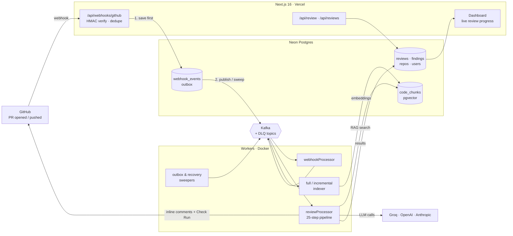
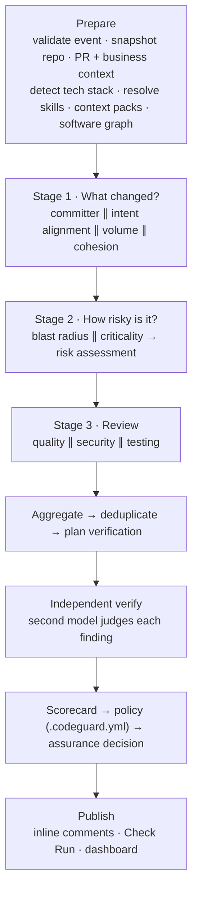

<div align="center">

# 🛡️ CodeGuard AI

**An AI code reviewer for GitHub pull requests that knows *how far* a change reaches before it judges it.**

CodeGuard AI reviews every pull request in stages. It maps the blast radius of the change
through the repo's import graph, pulls related code in with pgvector RAG, runs parallel
quality / security / testing reviewers, has a second model check every finding, and then
posts inline comments plus a Check Run that can block the merge.

[](https://github.com/GOURAVSINGH19/Codeguard-Ai/actions/workflows/ci.yml)


[**▶ Watch the demo**](#-demo) · [Architecture](#-architecture) · [How a review works](#-how-a-review-works) · [Engineering decisions](#-engineering-decisions) · [Run it locally](#-run-it-locally)

</div>

---

## ✨ Highlights

- **Event-driven backend.** GitHub webhooks are verified, saved to an outbox table and handed to Kafka. The HTTP handler returns right away, and the AI work happens in separate worker processes.
- **Blast-radius analysis.** Tree-sitter builds an import graph for the repo, and BFS over reverse edges finds every file affected by a change. A one-line edit to a widely imported utility counts for more than 200 lines in an isolated test.
- **RAG on the actual codebase.** Code is chunked by AST, embedded, and searched with pgvector. Reviews can say *"verifyJWT.ts trusts this value"* instead of giving generic advice.
- **A 25-step staged pipeline.** Change analysis, then risk assessment, then three reviewers in parallel, then independent verification, scorecard and policy decision.
- **Built to fail safely.** Transactional outbox, idempotency keys, dead-letter topics, retries with backoff, recovery sweepers, and Zod validation on every model response.
- **Works with any model provider.** Groq, OpenAI or Anthropic, chosen with one env var. Each provider only ever sees its own key.

---

## 🎬 Demo

<p align="center">
  
</p>

<p align="center"><a href="docs/demo/codeguard-demo.mp4">▶ Watch in full quality (MP4, 53s)</a></p>

The video follows one pull request: a one-line change that looks harmless but makes
JWT verification accept **unsigned tokens**.

```diff
- const ALG = "RS256";
+ const ALG = process.env.JWT_ALG ?? "none";
```

CodeGuard finds that `auth/verifyJWT.ts` and `middleware/csrf.ts` depend on this file,
flags the change as a critical security issue with a suggested fix, and fails the
**CodeGuard AI** Check Run so the PR can't be merged.

> **About hosting:** the web app is deployed on Vercel. The Kafka broker and workers
> aren't hosted around the clock (an always-on Kafka costs money), so the video shows
> the full flow end to end. Anyone can run the whole system with one
> `docker compose` command. See [Run it locally](#-run-it-locally).

---

## 🏗 Architecture


```mermaid
flowchart LR
    GH[GitHub<br/>PR opened / pushed] -- webhook --> WH

    subgraph Vercel["Next.js 16 · Vercel"]
        UI[Dashboard<br/>live review progress]
        WH["/api/webhooks/github<br/>HMAC verify · dedupe"]
        API["/api/review · /api/reviews"]
    end

    WH -- 1. save first --> OB[(webhook_events<br/>outbox)]
    API --> PG

    subgraph Data["Neon Postgres"]
        OB
        PG[(reviews · findings<br/>repos · users)]
        VEC[(code_chunks<br/>pgvector)]
    end

    OB -- 2. publish / sweep --> K{{Kafka<br/>+ DLQ topics}}

    subgraph Workers["Workers · Docker"]
        WP[webhookProcessor]
        RP[reviewProcessor<br/>25-step pipeline]
        IX[full / incremental<br/>indexer]
        SW[outbox & recovery<br/>sweepers]
    end

    K --> WP --> K
    K --> RP
    K --> IX
    SW --> K
    IX -- embeddings --> VEC
    RP -- RAG search --> VEC
    RP -- LLM calls --> LLM[Groq · OpenAI · Anthropic]
    RP -- results --> PG
    RP -- inline comments + Check Run --> GH
    PG --> UI
```

**Kafka topics:** `codeguard.webhook.received` → `codeguard.review.requested` → `codeguard.review.completed`,
plus `codeguard.index.full` and `codeguard.index.incremental`. Every consumer topic has a `.dlq` partner.

---

## 🔬 How a review works

The review is a typed pipeline of nodes ([`apps/workers/src/pipeline/reviewPipeline.ts`](apps/workers/src/pipeline/reviewPipeline.ts)).
**Required** nodes fail the run, and Kafka retries it. **Optional** nodes (context, intent,
graph, individual reviewers) are skipped with a note when they fail, so one flaky call
doesn't sink the whole review.


```mermaid
flowchart TD
    A["Prepare<br/>validate event · snapshot repo · PR + business context<br/>detect tech stack · resolve skills · context packs · software graph"] --> S1
    S1["Stage 1 · What changed?<br/>committer ∥ intent alignment ∥ volume ∥ cohesion"] --> S2
    S2["Stage 2 · How risky is it?<br/>blast radius ∥ criticality → risk assessment"] --> S3
    S3["Stage 3 · Review<br/>quality ∥ security ∥ testing"] --> F
    F["Aggregate → deduplicate → plan verification"] --> V
    V["Independent verify<br/>second model judges each finding"] --> D
    D["Scorecard → policy (.codeguard.yml) → assurance decision"] --> P
    P["Publish<br/>inline comments · Check Run · dashboard"]
```

| Step | What happens | Code |
| --- | --- | --- |
| **Ingest** | HMAC SHA-256 check with `timingSafeEqual`, de-duplication by `X-GitHub-Delivery`, saved to the outbox *before* publishing. A sweeper republishes anything Kafka missed. | [`apps/web/src/app/api/webhooks`](apps/web/src/app/api/webhooks), [`webhookOutboxSweeper.ts`](apps/workers/src/jobs/webhookOutboxSweeper.ts) |
| **Blast radius** | Tree-sitter extracts imports (TS/JS, Python, Go, Java, Rust, C++). BFS over reverse edges ranks affected files, then the riskiest complete patches fill the model's budget. | [`DependencyGraph.ts`](apps/workers/src/analyzers/DependencyGraph.ts), [`PRDiffSelector.ts`](apps/workers/src/analyzers/PRDiffSelector.ts) |
| **RAG** | AST-aware chunks are embedded with `text-embedding-3-small`. The diff is the query, and the nearest chunks go into the prompt as codebase context. | [`ASTChunker.ts`](apps/workers/src/analyzers/ASTChunker.ts), [`RAGService.ts`](apps/workers/src/rag/RAGService.ts) |
| **Staged review** | Three stages of reviewers, run in parallel within each stage. Every response is parsed with Zod and gets one repair attempt before it's rejected. | [`pipeline/nodes/stages.ts`](apps/workers/src/pipeline/nodes/stages.ts), [`review-engine/src/assurance`](packages/review-engine/src/assurance) |
| **Verify** | A separate model call marks each finding *confirmed*, *uncertain* (dropped one severity) or *rejected* (removed). Only confirmed findings can fail the check. | [`verify.ts`](packages/review-engine/src/verify.ts), [`finalize.ts`](apps/workers/src/pipeline/nodes/finalize.ts) |
| **Publish** | Inline PR comments with suggested fixes, a pass/fail Check Run, and a dashboard where progress streams live and findings can be resolved or dismissed. | [`github.ts`](packages/review-engine/src/github.ts), [`apps/web/src/app/reviews`](apps/web/src/app/reviews) |

---

## 🧠 Engineering decisions

<details open>
<summary><b>Why Kafka plus a transactional outbox, not a direct API call?</b></summary>

An AI review takes seconds to minutes, and GitHub expects a webhook response within 10 seconds.
The webhook handler only verifies, saves and publishes. If Kafka is down at that moment, the
row is still in `webhook_events`, and the worker's sweeper publishes it later. **No delivery is
lost.** Messages are keyed by `owner/repo#number`, so pushes to the same PR are processed in
order. Because of the outbox, the web app doesn't even need to reach Kafka: with
`KAFKA_PUBLISH_FROM_WEB=false` it only writes to Postgres, and the workers publish.
</details>

<details>
<summary><b>Why a dependency graph instead of truncating the diff?</b></summary>

The naive approach is `diff.slice(0, 12_000)`, which cuts at an arbitrary point, often mid-function.
Ranking files by blast radius means the model's limited context goes to the code most
likely to break. Unrelated files like `components/Button.tsx` are never sent.

```
Changed: utils/token.ts (+1 line)
  depth 1  auth/verifyJWT.ts      ← imports token.ts    HIGH
  depth 1  middleware/csrf.ts     ← imports token.ts    HIGH
  depth 2  routes/api/users.ts    ← imports verifyJWT   MEDIUM
  depth 3  app.ts                 ← budget full, excluded
```
</details>

<details>
<summary><b>Why a second "verifier" model?</b></summary>

A reviewer told to be thorough over-reports, and false positives quickly teach developers
to ignore the bot. An independent verifier sees the same diff plus the numbered findings and
judges each one. If the verifier itself fails, the review keeps the unverified findings rather
than losing the review.
</details>

<details>
<summary><b>Why treat Zod as the AI trust boundary?</b></summary>

Model output is untrusted input. Every response goes through a schema before it reaches the
database. A hallucinated `severity: "catastrophic"` or `score: 99` fails cleanly, gets one
repair attempt, and otherwise marks the run failed. Corrupt data never gets saved.
</details>

<details>
<summary><b>Why a service layer?</b></summary>

Route handlers used to mix auth, AI calls, database writes and GitHub calls. Now every route is
roughly *parse → auth → one service call → respond*, and the logic lives in testable classes
(`ReviewService`, `GitHubService`, `ReviewPersistenceService`, `UserService`).
</details>

---

## 🔐 Reliability & security

| Concern | How it's handled |
| --- | --- |
| Duplicate reviews | A partial unique index allows one live review per (PR, head SHA, requester). Webhook deliveries are de-duplicated. |
| Lost events | Transactional outbox and sweeper. Stuck reviews are picked up again by the recovery sweeper. |
| Poison messages | Invalid messages go straight to `*.dlq`. Failing ones go there after 3 attempts with backoff. Consumers heartbeat during long LLM calls. |
| Re-reviews | On `synchronize`, only the commits since the last review are sent. |
| Prompt injection | PR text and code go in the user message inside a random delimiter, and model output can't @-mention people. |
| Weakening the review from inside a PR | `.codeguard.yml` is read from the PR's **base** commit, never its head. |
| GitHub App installs | Linked only after the CSRF `state` and the user's own access to the installation are verified. |
| Everything else | Webhooks fail closed (unsigned ones are rejected), Kafka TLS is verified by default, API errors are generic, reviews are rate-limited per user, and gitleaks runs in CI. |

---

## 🧰 Tech stack

| Layer | Technology |
| --- | --- |
| Frontend | Next.js 16 (App Router), React 19, Tailwind CSS v4, light & dark themes |
| Auth | Clerk (GitHub OAuth) + GitHub App installation tokens |
| Messaging | Apache Kafka (KafkaJS) — KRaft, dead-letter topics |
| Workers | Node 22, TypeScript, Docker |
| Database | Neon Postgres, Drizzle ORM, pgvector |
| Code analysis | Tree-sitter (7 languages), BFS dependency graph |
| AI | Groq `openai/gpt-oss-120b` / OpenAI / Anthropic · OpenAI embeddings |
| Validation | Zod, end to end (env, API, events, model output) |
| Quality | Vitest (169 tests), strict typecheck, ESLint, gitleaks, `pnpm audit`, Dependabot |
| CI | GitHub Actions: typecheck ∥ lint ∥ test ∥ migrations & audit ∥ secret scan → build |

---

## 📁 Project structure

```
codeguard-ai/
├── apps/
│   ├── web/                       # Next.js UI + thin API routes
│   │   └── src/
│   │       ├── app/api/           # webhooks · review · reviews (+ live events) · github
│   │       ├── services/          # business logic (Review, GitHub, Persistence, User)
│   │       └── components/        # dashboard, PR reviewer
│   └── workers/                   # Kafka consumers (Docker image)
│       └── src/
│           ├── pipeline/          # 25-step staged review (prepare → stages → finalize)
│           ├── analyzers/         # Tree-sitter imports, AST chunker, dependency graph
│           ├── jobs/              # webhook / review / indexers / outbox & recovery sweepers
│           ├── rag/               # pgvector similarity search
│           └── queue/             # consumer with retries + DLQ
├── packages/
│   ├── review-engine/             # prompts, providers, staged reviewers, verifier, GitHub output
│   ├── kafka/                     # topics, event schemas, shared producer
│   ├── db/                        # Drizzle schema (8 tables) + migrations
│   ├── config/                    # Zod-validated env, one source of truth
│   └── types/                     # shared Zod schemas
├── infra/kafka/                   # Kafka image for a private cloud service
├── docs/demo/                     # demo video + the HTML it's recorded from
└── docker-compose.yml             # Kafka + worker (+ Redis)
```

---

## 🚀 Run it locally

**You need:** Node 22+, pnpm 10+, Docker, and free accounts on [Clerk](https://clerk.com),
[Neon](https://neon.tech) and [Groq](https://console.groq.com), plus an
[OpenAI](https://platform.openai.com) key for embeddings and a GitHub App.

```bash
git clone https://github.com/GOURAVSINGH19/Codeguard-Ai.git
cd Codeguard-Ai
pnpm install
```

**1. Environment.** Copy [`.env.example`](.env.example) to `apps/web/.env.local` and `apps/workers/.env`,
then fill them in. Every variable is validated at startup by [`packages/config/src/env.ts`](packages/config/src/env.ts).

<details>
<summary>GitHub App setup</summary>

- Permissions: **Pull requests: write**, **Checks: write**, **Contents: read**.
- Setup URL: `https://<your-app>/api/github/app/callback`, with **"Request user authorization (OAuth) during installation"** enabled.
- Webhook URL: `https://<your-app>/api/webhooks/github`. `GITHUB_APP_WEBHOOK_SECRET` is required outside development.
- Workers mint installation tokens from `GITHUB_APP_ID` + `GITHUB_APP_PRIVATE_KEY`.
</details>

**2. Database.** Enable pgvector once in the Neon SQL console (`CREATE EXTENSION IF NOT EXISTS vector;`), then run:

```bash
pnpm db:migrate
```

**3. Kafka and workers.** This starts a single-node Kafka (KRaft) and the worker container:

```bash
docker compose up -d --build kafka worker
```

**4. Web app.**

```bash
pnpm dev:web
```

Open http://localhost:3000, install the GitHub App on a repo, and open a pull request.

> To work on the workers with hot reload, skip the `worker` container and run
> `pnpm --filter workers dev:local` (it connects to the compose Kafka on `localhost:19092`).

**Tests:**

```bash
pnpm test
```

```bash
pnpm typecheck
```

### Per-repo settings: `.codeguard.yml`

```yaml
ignore:              # globs never sent to the model (lockfiles are ignored by default)
  - "docs/**"
min_severity: low    # findings below this aren't posted
fail_on: critical    # Check Run fails at or above this ("never" to never fail)
instructions: |      # team conventions added to the prompt
  We return Result<T, E> instead of throwing.
```

---

## 🗺 Roadmap

- **Learning from feedback.** Use dismissed findings as team memory to suppress patterns a repo keeps rejecting.
- **Evaluation set.** Real PRs with known bugs, to measure precision and recall across models and prompts.
- **Jira / Linear intent check.** Compare the PR against the ticket it claims to implement.
- **Fully self-hosted mode.** Docker Compose with a local model instead of a hosted LLM.

---

<div align="center">

Built by **[Gourav Singh](https://github.com/GOURAVSINGH19)**. If you have questions or feedback, open an issue.

</div>
